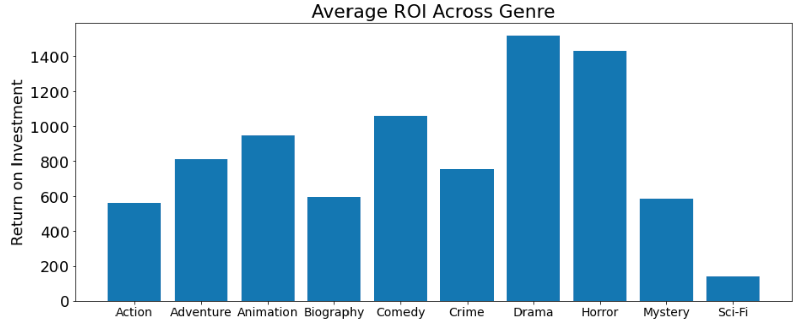
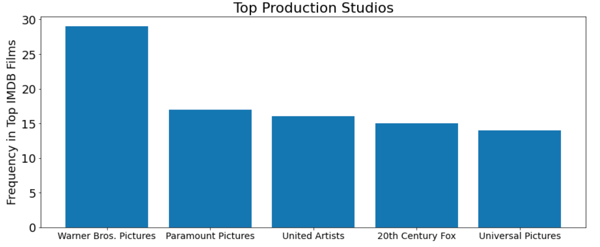
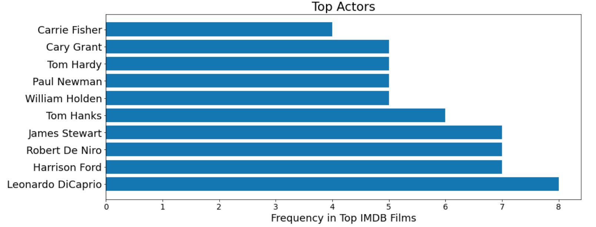
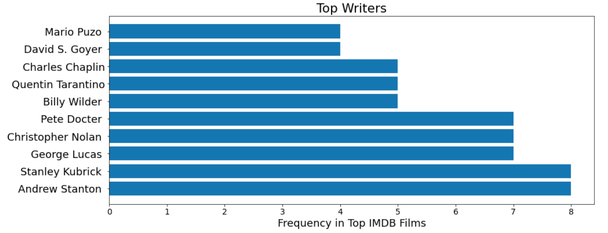

 
# Film Analysis Project

**Authors**: Sierra Stanton

## Overview

This project analyses the film industry as we determine what initial questions should be answered for a newcomer interested in starting their own studio. We have been charged with helping Microsoft determine which types of films do best at the box office and what to keep in mind as they enter a new, highly competitve sector. We'll use two datasets to compare film attributes and garnered profits. Microsoft can use the following analysis to determine what genres of original content they'd like to focus on, which competitors are the most revered, and who they'll want on their team.

.

Second, since Microsoft doesn't know anything about creating movies - we'll hand over proven recommendations on who to hire with experience in a production's most pivotal roles. From directors to writers and more, we'll do a deep dive into the most revered among each role. We'll even give a little insight into some of the executives pulling the strings. 

Whether Microsoft wants to collaborate with the storytellers, bring them on as advisors, or simply have a greater understanding of the competition - that short list of people will be revealed.

## Data

Data will be used from the following sources:
* __[The Numbers](https://the-numbers.com)__
* __[IMDB](https://imdb.com)__

The Numbers' Film Budgets (`tn.movie_budgets.csv.gz`): this dataset shows us monetary numbers worth considering when planning to produce a film. This includes the initial production budget and gross earning at both a domestic and worldwide scale for the film in question. We are also given the release date of the film for additional context. I intend to match the production budget and worldwide gross earnings wiith IMDB's top films to gain insight. This will be further developed with a new column we'll create - ROI.

IMDB's Top 250 Films(`IMDB_Top250Engmovies2_OMDB_Detailed.csv.gz`): this dataset shows us the 250 most popular films on IMDB.com and many of the film's attributes. The information we'll be most interested in analyzing revolves around the type of film (genre) and the people involved in bringing the film to life (directors, writers, actors, production).

## Methods & Results

I use descriptive analysis to show (1) the most frequented genres in top films and which genres prove most profitable, (2) the studios that most frequently produce top films, and (3) the storytellers most represented in hit films.

Due to the datasets used and their current nature, I'm confident these findings will prove relevant as Microsoft starts their new studio. There are many more ways we can deepen our analysis to prove even more insightful with more time and access to more data.

### Genres Held in the Highest Regard


### Average ROI Across Film Genres


### Studios Most Frequently Behind Top Films


### Top Directors


### Top Writers


### Top Actors


## Conclusions

Provide your conclusions about the work you've done, including any limitations or next steps.

* **Hire revered storytellers.** Our distributions show us that audiences tend to favor particular storytellers above the rest. These films clearly have a much higher chance of winning at the box office.
* **Poach executives and/or collaborate with the top studios.** Since one of Microsoft's greatest pain points is not having the know how to create great films, we need to keep in mind that great filmmakers often need truly great executives behind the scenes in order for their work to flourish. We can poach high quality executives with pre-existing relationships in Hollywood to help us bridge the gap. We also saw that quite a few of the top films had more than one studio on board. We don't have to go it alone, especially in the beginning as we get our bearings.
* **Focus on drama with your content and your wallet.** While there are quite a few ways to expand beyond this primary genre and make a truly great film, this tends to be the backbone of the greats. Microsoft shouldn't ignore this and instead should make the majority of their upcoming releases a Drama as the studio starts up. Due to drama being more of a sure bet, they also should expect more return on investment from budget spent on these films and their advertising.
* **Budget for multiple writers per film.** We can see that there is on average there is more than one writer per film in our IMDB dataset. While this isn't necessary, it tends to point toward a great film.

## Next Steps

This goes beyond our film analysis and is worth further exploration.

* **Groom less experienced storytellers.** If Microsoft develops a repeated process where experienced storytellers groom up and comers, Microsoft is much more likely to develop a steady stream of quality filmmakers that audiences will grow to love. Due to the popularity of streaming, this could mean even there ealier work can get future recognition and revenue.
* **Pay attention to a growing trend toward diversity.** One of Microsoft's primary values stated is diversity and inclusion. Viewers across the US and the world are becoming increasingly diverse and studies show that audiences favor stories that reflect their own. Microsoft has the chance to launch with this sort of understanding in their DNA. While diversity is sometimes noted in Hollywood, there are enormous strides needed (see UCLA's 2020 Diversity Report) and there isn't a larger studio yet that has adamantly stood for diversity in front of and behind the camera. Quality storytellers are starting to make film decisions based on these factors (see efforts like the inclusion rider). Many of the necessary pieces and collaborators are already in existence (see firms like Charles King's MACRO, Scott Budnick's One Community, Ava Duvernay's Array)I believe this is a trend worth betting on for the long term and can make Microsoft stand apart. I'd like to prove it.
* **Expand on our findings to chart increasingly current findings** While our IDMB dataset showed the current top 250 films, there is such a range of years covered that we could determine attributes and trends that have changed over time and would enhance these findings to become increasingly relevant. We could also introduce additional current ways of gauging the success of a film - by introducing streaming metrics and data around evergreen content that continues to take in profit and royalties. We could also expand beyond the medium to enlist Microsoft's studio to create other types of visual content versus long-form films.

## For More Information

Please review our full analysis in [our Jupyter Notebook](./dsc-film-analysis-project.ipynb) or our [presentation](./DS_Project_Presentation.pdf).

For any additional questions, please contact **Sierra Stanton** & stanton.sierraerin@gmail.com

## Repository Structure

Describe the structure of your repository and its contents, for example:

```
├── README.md                           <- The top-level README for reviewers of this project
├── dsc-phase1-project-template.ipynb   <- Narrative documentation of analysis in Jupyter notebook
├── DS_Project_Presentation.pdf         <- PDF version of project presentation
├── data                                <- Both sourced externally and generated from code
└── images                              <- Both sourced externally and generated from code
```
